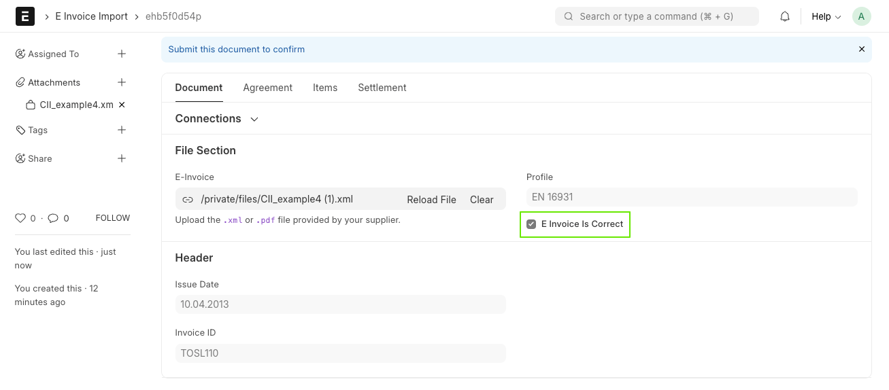
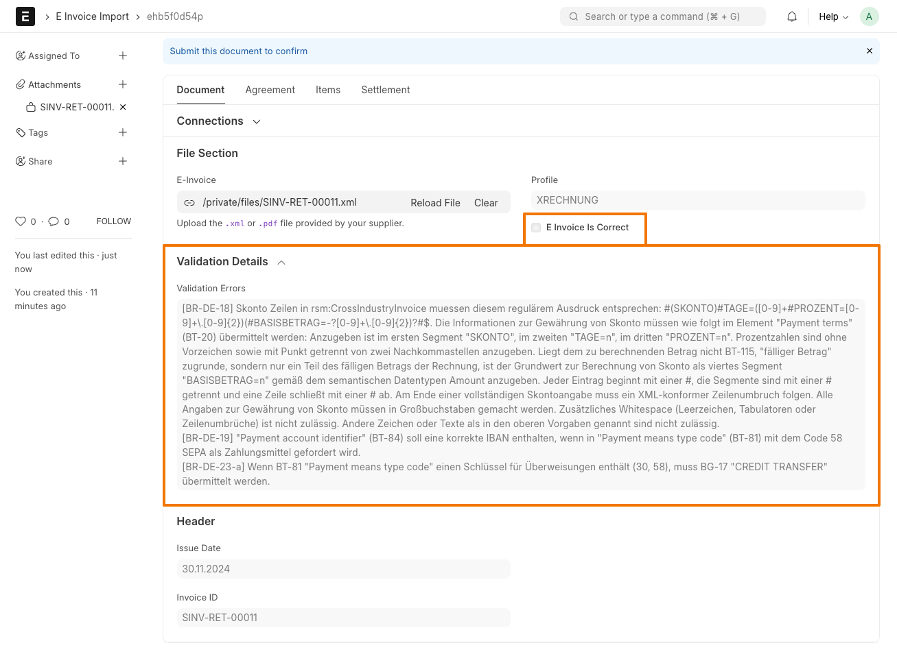

To import a new eInvoice, create a new **E Invoice Import** and upload the XML or PDF file.

The app extracts the E-Invoice Profile and validates the XML against the corresponding schematron rules.

A correct eInvoice will look like this:

A problematic eInvoice will look like this. You can see the validation errors in the _Validation Details_ section:

It is still possible to import an invoice, even if there are formal validation errors.

## Extracted fields

The following fields are currently extracted from the eInvoice:

- Invoice ID
- Issue Date
- Currency
- Seller (Supplier)
    - Name
    - Tax ID
    - Electronic Address Scheme
    - Electronic Address
    - Address
        - Address Line 1
        - Address Line 2
        - Postcode
        - City
        - Country
- Buyer (Company)
    - Name
    - Electronic Address Scheme
    - Electronic Address
    - Address
        - Address Line 1
        - Address Line 2
        - Postcode
        - City
        - Country
- Buyer Reference (mapped to Purchase Order if it exists)
- Items
    - Product Name
    - Product Description
    - Seller's Product ID
    - Buyer's Product ID (mapped to Item Code if it exists)
    - Billed Quantity
    - Unit Code (mapped to UOM)
    - Net Rate
    - Tax Rate
    - Total Amount
- Taxes
    - Basis Amount
    - Rate Applicable Percent
    - Calculated Amount
- Payment Terms
    - Due Date
    - Partial Amount
    - Description
    - Discount Basis Date
    - Discount Calculation Percent
    - Discount Actual Amount
- Payment Means
    - Payee Account Name
    - Payee BIC
    - Payee IBAN
- Billing Period
    - Start Date
    - End Date

Taxes are mapped to "Actual" charges in the **Purchase Invoice**, so that ERPNext does not try to recalculate them.

You can find XML files for testing in the following repositories:

- [EN16931](https://github.com/ConnectingEurope/eInvoicing-EN16931/tree/master/cii/examples)
- [XRechnung](https://projekte.kosit.org/xrechnung/xrechnung-testsuite/-/tree/master/src/test/business-cases/standard?ref_type=heads) (files ending in `_uncefact.xml`)
